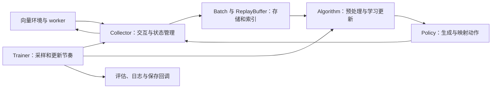

# RL 基础设施：从算法实现到可扩展实验代码

Tianshou 纳入本库的 **RL infra 学习主线**，源码在 [D07_Tianshou](../repositories/decision/D07_Tianshou)，逐项入口见[学习卡](../notes/D07_Tianshou.md)。本专题关注数据、状态、接口与训练调度怎样组织，帮助你在以后加入视觉编码器、记忆模块或新损失时，保持实验代码可理解、可检查。

## 四个仓库分别学什么

| 仓库 | 在本路线中的主要用途 | 重点学习 | 阅读后的产出 |
| --- | --- | --- | --- |
| [CleanRL](../notes/D01_CleanRL.md) | 看清一个算法的完整训练过程 | 采样、优势／目标、损失、优化与评估怎样串起来 | 一张算法到代码的对应图 |
| [Stable-Baselines3](../notes/D02_Stable-Baselines3.md) | 理解通用算法库与实验基线 | 基类、policy、buffer、callback 与环境封装 | 说明自定义网络或环境应该接在哪层 |
| [Tianshou](../notes/D07_Tianshou.md) | 学习面向算法研发的基础设施 | Policy／Algorithm 分工、Batch、Collector、Buffer、Trainer | 可追踪数据流的最小实验入口与接口说明 |
| [MALib](../notes/D06_MALib.md) | 进入种群和分布式训练系统 | 任务派发、策略管理、数据服务与跨进程通信 | 数据与模型版本的流转图 |

这张表是本资料库对学习重点的安排，各库实际功能有交集。推荐顺序是 **CleanRL → Tianshou → 对照 SB3 → 按研究需要进入 MALib**。SB3 可在整个过程中提供熟悉的基线；暂时不需要掌握所有库。

## 先确认版本与论文的关系

这次保留的是你下载的本地 `master` 工作文件，`pyproject.toml` 标记版本 **2.0.1**，最近提交日期为 2026-04-03；整合日期为 2026-09-26，没有用在线最新源码覆盖它。MIT 许可、示例、文档和测试均保留；原 `.git` 移到本地忽略目录 `downloads/git_backups/`，不提交到资料库。

[Tianshou 框架论文](../papers/decision/tianshou.pdf)发表于 JMLR 2022，用来理解模块化与统一接口的动机。当前 v2 的代码架构已经变化：**Policy 负责动作生成，Algorithm 负责学习更新**，训练器也按 on-policy、off-policy 和 offline 分开。旧资料中的 `PPOPolicy`、`process_fn → learn → post_process_fn` 不能直接作为当前文件和接口名称。先看本地 [CHANGELOG](../repositories/decision/D07_Tianshou/CHANGELOG.md) 与 [README](../repositories/decision/D07_Tianshou/README.md)，再追当前调用链。[原始论文页面](https://jmlr.org/papers/v23/21-1127.html)与[上游版本说明](https://github.com/thu-ml/tianshou/blob/master/CHANGELOG.md)可用于核对。

## 先画职责，再读实现

| 模块与实际文件 | 阅读时要回答的问题 |
| --- | --- |
| [Policy／Algorithm](../repositories/decision/D07_Tianshou/tianshou/algorithm/algorithm_base.py) | 推理与训练怎样分工？算法的一次更新包括哪些阶段？哪些状态属于网络，哪些由外部组件管理？ |
| [Batch](../repositories/decision/D07_Tianshou/tianshou/data/batch.py)与[字段协议](../repositories/decision/D07_Tianshou/tianshou/data/types.py) | 字段、切片、拼接和 NumPy／Torch 转换怎样保持样本对应？缺失字段和可变结构怎样处理？ |
| [Collector](../repositories/decision/D07_Tianshou/tianshou/data/collector.py) | 动作怎样进入环境？采样结果怎样回写？环境重置、隐藏状态重置和 buffer 重置为什么不同？ |
| [ReplayBuffer](../repositories/decision/D07_Tianshou/tianshou/data/buffer/buffer_base.py)与[VectorReplayBuffer](../repositories/decision/D07_Tianshou/tianshou/data/buffer/vecbuf.py) | 环形索引、episode 边界与多环境数据怎样管理？怎样避免把不同环境的轨迹连起来？ |
| [向量环境](../repositories/decision/D07_Tianshou/tianshou/env/venvs.py)与[worker](../repositories/decision/D07_Tianshou/tianshou/env/worker/subproc.py) | 同步／异步的等待、返回顺序和进程边界在哪里？哪种任务适合多进程？ |
| [Trainer](../repositories/decision/D07_Tianshou/tianshou/trainer.py) | 每次采集多少、更新多少、何时评估？环境步数、训练器更新次数与实际梯度次数有何区别？ |
| [Logger 接口](../repositories/decision/D07_Tianshou/tianshou/utils/logger/logger_base.py) | 指标的横轴是什么？保存回调保存了什么？恢复了计数是否就等于恢复完整实验？ |
| [High-level Experiment](../repositories/decision/D07_Tianshou/tianshou/highlevel/experiment.py) | 如何在上述机制之上组装配置与实验？哪些细节被高层 API 隐藏？ |

## 第一条链路：CartPole PPO

入口是 [test/discrete/test_ppo_discrete.py](../repositories/decision/D07_Tianshou/test/discrete/test_ppo_discrete.py)。这里的 `test_ppo` 包含环境、网络、策略、算法、采集器、日志、训练配置和奖励断言，是可阅读的完整训练入口。**它包含真实训练，不是低成本的单元测试**；初读时先做静态追踪。

1. 记录 `DiscreteActorPolicy`、`PPO`、`Collector`、`VectorReplayBuffer`、`OnPolicyTrainerParams` 各自构造时收到什么。
2. 从 `algorithm.run_training(...)` 进入训练器，找到采集与 `OnPolicyTrainer._update_step`。
3. 进入 `OnPolicyAlgorithm.update`：这里传入整轮 buffer，内部由 `Algorithm._update` 组织 `buffer.sample → _preprocess_batch → _update_with_batch → _postprocess_batch`。
4. 进入 [PPO 实现](../repositories/decision/D07_Tianshou/tianshou/algorithm/modelfree/ppo.py)，追踪优势、旧 log probability、mini-batch、重复更新和 clip loss，核对 [PPO 论文](../papers/decision/ppo.pdf)。
5. 回到训练器，检查 `reset_buffer(keep_statistics=True)`：当轮训练数据被清空，但尚未结束的 episode 统计需要保留。

产出一页记录：一个 batch 的字段与形状、哪些计算不反传、何时更新参数、为什么 on-policy buffer 在更新后清空。

## 第二条链路：SAC 与经验回放

入口是 [examples/mujoco/mujoco_sac.py](../repositories/decision/D07_Tianshou/examples/mujoco/mujoco_sac.py)。先读源码，再按所选环境安装依赖；不在学习起步时直接照搬大规模默认训练预算。

跟踪 `SACPolicy + SAC → Collector 的随机 warm-up → OffPolicyTrainer → 从 buffer 反复采样 → SAC._update_with_batch`。与 PPO 对照：SAC 保留并复用历史数据，一次采样之后可能有多次更新。当前训练器按 `round(update_step_num_gradient_steps_per_sample × n_collected_steps)` 计算该轮更新次数；修改并行环境数时，也要检查实际采样量和更新预算。

再读 [SAC 实现](../repositories/decision/D07_Tianshou/tianshou/algorithm/modelfree/sac.py)，分别追双 critic、actor、熵温度和目标网络。用 [SAC 论文](../papers/decision/sac.pdf)理解目标；对动作分布、tanh 校正等实现细节，还应结合仓库 README 引用的后续 SAC 论文版本，不假定所有细节只来自已收录的 ICML 2018 论文。

产出两张表：PPO／SAC 的数据生命周期对照；各 loss、参数、optimizer 和目标网络的对应表。

## 最值得读的基础设施测试

优先读 [test_batch.py](../repositories/decision/D07_Tianshou/test/base/test_batch.py)、[test_buffer.py](../repositories/decision/D07_Tianshou/test/base/test_buffer.py)、[test_collector.py](../repositories/decision/D07_Tianshou/test/base/test_collector.py) 和[简单测试环境](../repositories/decision/D07_Tianshou/test/base/env.py)。它们展示了怎样把复杂训练流程拆成可检查的数据行为。这里是建议阅读与练习，本次整合没有运行这些测试。

特别检查三个边界：

- **终止与截断**：Collector 用 `terminated OR truncated` 判断 episode 结束；当前 `Algorithm.value_mask` 用 `~terminated` 决定 bootstrap 的有效性。二者服务不同目的，要结合目标计算和环境语义理解。
- **多个环境**：观察 buffer 的环境索引和 episode 索引；重置已结束环境时，只重置对应隐藏状态。RNN 的历史不能串到其他环境或新 episode。
- **保存与恢复**：区分部署需要的动作网络与继续学习需要的算法状态。入口中的 `state_dict` 保存不能自动证明 replay、环境内部状态、随机数、日志步数和调度全部恢复。

## 建议完成的四个编程练习

| 练习 | 操作 | 验收结果 |
| --- | --- | --- |
| 最小实验入口 | 在自己的练习目录组织 CPU CartPole PPO；配置、日志与运行输出分开 | 能解释每个对象的职责；入口与本地 v2 API 一致 |
| 数据契约 | 用一个简单环境记录 transition 字段、shape、env_id、episode 边界与 state | 终止、截断、多环境 reset 的预期行为明确 |
| 训练预算 | 对照两组环境并行数，分别记录采样时间、环境步数、梯度更新数和耗时 | 不把采样吞吐提升误当成策略质量或样本效率提升 |
| 保存与恢复 | 列出继续训练所需状态，检查一次短运行的保存与恢复 | 明确恢复了哪些状态；无法恢复的环境或 replay 状态写清楚 |

前两项读通后，再尝试修改学习目标或接入视觉编码器。接入图像时先明确观测 shape、dtype、归一化位置、回放内存和 encoder 的梯度路径；普通 CartPole／MuJoCo 状态输入示例并不自动构成视觉感知决策系统。

8 张 4090 优先支持独立种子、配置与任务。先找到瓶颈：环境运行、Python 调度、进程通信、数据搬运或模型更新；向量环境数不等于 GPU 数，异步 Collector 也不等于跨机器分布式训练。只有测量证明值得扩大并行度时，再增加系统复杂度。

[返回代码阅读指南](代码阅读指南.md) · [返回论文阅读指南](论文阅读指南.md) · [返回学习路线](学习路线与选题判断.md)
