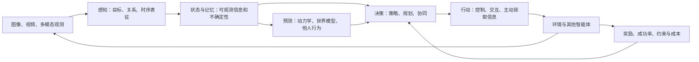

# 感知与决策：学习路线与选题判断

适用对象：已具备 PyTorch 和强化学习入门基础、尚未限定应用场景、至少可以使用 8 张 RTX 4090 的博士生。资料检索日期：2026-09-26。

## 1. 我对你的方向的判断

建议把“感知与决策”作为一个闭环问题来理解：从观测中提取与任务有关的状态，预测行动后果，再选择行动，并通过交互改变下一步可获得的信息。感知研究的输出未必是完整的场景描述，决策研究的输入也不应永远假定为干净、充分的真实状态。

黄凯奇老师的[自动化所官方介绍](https://ia.cas.cn/rcdw/qch/202404/t20240422_7129813.html)列出了计算机视觉、模式识别、认知决策与人机对抗等方向。老师参与的 [GlobalTrack](https://arxiv.org/abs/1912.08531)、[CSTrack](https://arxiv.org/abs/2505.19434)、[TAPE](https://arxiv.org/abs/2312.15667) 和 [CoS](https://arxiv.org/abs/2509.19003) 能提供几种不同的切入点：目标状态估计、多模态时序表征、协作关系与视觉语言奖励。这说明你的准备值得同时覆盖视觉和强化学习；它不意味着老师已经为你指定了具身机器人或某个具体任务。

我的建议是先建立共享知识，再选择一个主问题。第一阶段重点精读 8 篇：DETR、DINOv2、ByteTrack、PPO、SAC、DrQ-v2、DreamerV3、MAPPO。其余资料作为定位问题与深入分支的工具，不需要同时复现全部项目。

## 2. 感知侧要学到什么

视觉分类只是起点。你需要理解对象如何从图像中被抽取，身份如何跨帧保持，外观和运动如何融合，以及语言如何指定当前任务关注的对象。对应的材料是 DETR、ByteTrack／GlobalTrack、CSTrack 和 GroundingDINO。

DINOv2／DINOv3 用于建立另一个能力：判断通用预训练表征是否适合你的下游任务。建议先做冻结特征、线性头或轻量适配，再考虑端到端训练。8 张 4090 能支持有价值的下游研究，但不能因此假定可以经济地重复视觉基础模型的原始预训练。

读感知论文时，应明确监督信号、输入模态、时间窗口、是否使用未来帧，以及部署时可用的信息。跟踪的 IDF1／HOTA、检测的 AP、分类准确率都各有用途；闭环任务还需要成功率、碰撞率、交互步数和延迟。更高的检测 AP 是否改善策略成功率，需要在具体任务中测量。

ResNet 和 ViT 两篇论文已作为补充下载。你已经入门，若能解释残差、注意力、patch token 与训练稳定性的关系，可快速复习，不必把它们当作新的完整复现项目。

## 3. 决策侧要学到什么

先把 PPO 和 SAC 对应到真实实现：优势估计、采样与更新频率、终止与截断处理、概率比、动作分布、目标网络、熵温度及经验回放。CleanRL 适合逐行阅读，Stable-Baselines3 适合建立可重复的实验基线，Tianshou 适合系统学习算法研发所需的基础设施。这些是不同用途的实现工具，不是 PPO／SAC 原作者代码。

单独建立一条[RL infra 学习主线](RL基础设施学习专题.md)：CleanRL → Tianshou → 对照 SB3 → 按需 MALib。先理解一个算法，再学习 Policy／Algorithm、采集器、结构化 batch、回放、训练调度和日志怎样分工。Tianshou 的本地源码是 v2，先核对版本再使用教程。建议在前两周读通 CleanRL 后进入其 CartPole PPO 链路，后续按需追 SAC 和向量采样，不额外要求一开始完成四个库的训练。

第二层是部分可观测和多智能体。理解 MDP／POMDP 的区别、历史与循环状态、集中训练分散执行、信用分配、其他智能体引起的非平稳性。MAPPO 提供强基线，QMIX 提供价值分解视角，TAPE 把协作拓扑引入策略学习。注意许多 SMAC 实验使用数值化局部观测；它们本身并不是直接从相机像素学习的感知系统。

第三层是交互效率。DrQ-v2 从像素直接学控制，DreamerV3 用潜在动力学支持策略学习，MALib 展示种群和分布式训练组织。8 张 GPU 的研究收益往往首先来自多个随机种子和可控对照，而非把每个小策略网络强行做八卡同步训练。

## 4. 感知和决策之间的三条优先路线

下表是选题建议，不是对创新性或发表结果的承诺。确定课题前仍需围绕具体问题补查近期文献。

| 路线 | 核心问题 | 起步资料 | 为什么适合你 | 当前优先级 |
| --- | --- | --- | --- | --- |
| 任务相关的视觉表征与鲁棒决策 | 策略真正需要哪些视觉信息？表征在遮挡、背景改变时是否仍保留控制所需信息？ | DINOv2、DrQ-v2、DreamerV3 | 感知和决策联系直接，能够从单卡任务建立可解释基线 | 首选通用路线 |
| 多智能体的感知误差与协同 | 当局部观测缺失或不可靠时，记忆、通信、协作关系如何影响团队收益？ | MAPPO、QMIX、TAPE、CSTrack | 与老师公开的视觉和协作决策工作有联系；后续可加入视觉输入 | 适合与老师优先讨论 |
| 视觉动作学习与泛化 | 从视觉、语言、示范到动作，如何降低数据需求并保持跨场景成功率？ | ACT、Diffusion Policy、OpenPI | 现有算力支持单任务训练和部分适配；有机器人或成熟仿真资源时更有价值 | 依赖平台条件 |

CoS 是连接视觉理解与强化学习训练的进阶参考，但视觉语言问答能力提升与物理环境中正确行动是不同的验证目标。若选择它，应先确定自己研究的是视觉推理、奖励建模，还是实体／仿真行动，不能用问答分数代替行动成功率。[论文](https://arxiv.org/abs/2509.19003)与[官方代码](https://github.com/baaivision/CoS)见配套学习卡。

Habitat 则适合把视觉、记忆、导航和环境交互接起来。它同时引入模拟器版本、场景数据和环境部署成本。建议在 DrQ-v2 的较简单视觉控制任务后，再进入导航或移动操作，不要同时承担算法学习和整套模拟器排错。

## 5. 12 周安排

时间是建议节奏，不是已测量的复现耗时。你可以根据此前经验压缩前两周。

| 周次 | 重点阅读与代码 | 应交付的学习结果 |
| --- | --- | --- |
| 1–2 | PPO／SAC + CleanRL；DETR；读通后加入 Tianshou PPO 的模块职责 | 一页算法到代码的对应图；能够解释采样、更新和集合预测的完整路径，区分 Policy 与 Algorithm |
| 3–4 | DINOv2 + ByteTrack；补读 GlobalTrack | 一个特征／跟踪结果的可视化；记录遮挡、重识别和误检的具体失败例 |
| 5–6 | DrQ-v2 | 从图像输入到动作输出的训练闭环；读懂增强、回放和 actor–critic 的连接 |
| 7–8 | DreamerV3；与 DrQ-v2 对照理解 | 说明世界模型训练目标、潜在状态及策略学习流程；检查当前代码与论文版本差异 |
| 9–10 | MAPPO + QMIX；深入 TAPE | 解释集中训练分散执行；区分全局状态、局部观测和协作图 |
| 11–12 | 在前三条路线中选择一条；按需加入 Habitat、ACT／Diffusion Policy 或 CoS／OpenPI | 给老师一份问题定义、可用平台、可靠基线、失败案例与下一步假设 |

每篇论文建议保留六项笔记：它解决的具体问题、关键假设、相对基线的改变、训练信号、指标与失败场景、你能用现有平台验证的部分。目标是能够解释一个结果为什么出现，而不仅是运行了作者命令。

## 6. 8 张 4090 如何安排

先确认是同机八卡还是多机分布，以及 CPU 核数、内存、NVMe 容量、PCIe 拓扑与互联。显存约为每卡 24GB，普通数据并行仍在每卡保存一份模型和优化器状态；分片训练才能降低单卡相关状态的占用，通信代价需实测。

起步阶段建议单卡确认链路，再把多卡用于独立任务或随机种子。DrQ-v2、MAPPO 等项目不能未经检查就假定支持你所需的 DDP／多节点方式。视觉策略的大部分实验还受环境采样和 CPU 吞吐影响。

OpenPI 官方 README 给出的单卡估算是：推理大于 8GB、LoRA 微调大于 22.5GB、全量微调大于 70GB；同时说明可用 `fsdp_devices` 分片，当前训练脚本不支持多节点。单张 4090 的 LoRA 显存余量很小；先从官方配置验证，再考虑同机多卡，不能据此保证任意任务均能训练。[官方要求](https://github.com/Physical-Intelligence/openpi#requirements)

CoS 涉及基座模型、过程奖励与强化学习训练，显存还取决于序列长度、图像 token、并行方式和同时驻留的模型。8 张 4090 是适配和受控规模实验的良好起点，不等于可以无条件复现所有规模的原始实验。

## 7. 筛选范围与限制

本库选择的是有学习价值、能核对论文与代码关系、覆盖关键范式的资料，不是 2026 年所有最新工作的排名。经典论文用于理解方法，近期项目用于观察问题演进。任何选题都还需要任务限定后的新一轮文献检索。

这次工作完成资料收集、来源核对、PDF 可解析性检查与代码入口检查；没有在当前 Mac 上安装所有项目依赖、运行 CUDA 训练或复现论文结果。导师相关与通用基线分别标注；没有把名称相近的项目直接视为同一实现。

M2RL 的论文原始代码入口已经定位到[自动化所人机对抗门户](http://turingai.ia.ac.cn/ai_center/show/14)。页面要求申请并经审核后通过注册邮箱提供下载，不能视为匿名可直接下载的源码。保留其两篇相关论文用于阅读，使用已公开可下载的 MALib 学习种群与分布式训练；MALib 不属于 M2RL 的实现。
